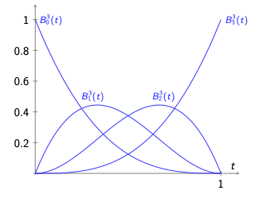

# Beziérova krivka
Parametrická krivka definovaná $n+1$ riadiacimi bodmi $P_i$, kde $n \geq 1$:

$$
P(t) = \sum_{i=0}^{n} P_i B_i^n(t), \text{ kde } t \in (0,1)
$$

## Bázové funkcie

Pre výpočet bázových funkcií $B_i^n(t)$ používame:
$$
B_i^n(t) = \binom{n}{i} t^i (1-t)^{n-i}
$$

### Kombinačné číslo
$$
\binom{n}{i} = \frac{n!}{i!(n-i)!}
$$

### Bázové funkcie pre n=3
$
P(t) = \sum\limits_{i=0}^{3} P_iB_i^3(t), \text{ kde } t \in (0,1)
$ 

$
B_0^3(t) = (1-t)^3,\\
B_1^3(t) = 3t(1-t)^2,\\
B_2^3(t) = 3t^2(1-t),\\
B_3^3(t) = t^3
$

$
P_3(t) = (1-t)^3P_0 + 3t(1-t)^2P_1 + 3t^2(1-t)P_2 + t^3P_3
$

### Vlastnosti bernsteinových polynomov
#### Symetria
$B_{n-i}^n(1-t) = B_i^n(t)$
#### Rekurzia
$B_i^{n+1}(t) = tB_{i-1}^n(t) + (1-t)B_i^n$
#### Nezápornosť
$B_i^n(t) \geq 0, \text{ pre } t \in <0,1>$
#### Súčet polynomov v akomkoľvek t sa rovná 1