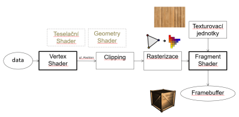

# Vykresľovací reťazec / Graphics Pipeline



## Data

```cpp
const float data[] = {
    //vrchol, normála, uv souřadnice
    1.0f, 0.0f, 1.0f,   0.0f, 1.0f, 0.0f,   0.0f, 0.0f,
    1.0f, 0.0f,-1.0f,   0.0f, 1.0f, 0.0f,   10.0f, 0.0f,
   -1.0f, 0.0f,-1.0f,   0.0f, 1.0f, 0.0f,   10.0f, 10.0f,
 
   -1.0f, 0.0f, 1.0f,   0.0f, 1.0f, 0.0f,   0.0f, 10.0f,
    1.0f, 0.0f, 1.0f,   0.0f, 1.0f, 0.0f,   0.0f, 0.0f,
   -1.0f, 0.0f,-1.0f,   0.0f, 1.0f, 0.0f,   10.0f, 10.0f
};
```
Vytvoríme identifikátory **Vertex Buffer Object** (VBO) a **Verter Array Object** (VAO). Nahráme dáta do array bufferu GPU a buffer priradíme k VBO. 

`glDrawArrays(GL_TRIANGLES, 0, 6);` spustí pipeline.

## Vertex Shader
Každý vrchol prejde vertex shaderom. Výstup je gl_Position:
```glsl
ex_worldPos = modelM * vec4(vp, 1.0);
mat4 normal = transpose(inverse(modelM));
ex_worldNorm = vec3(normal * vec4(vn, 1.0));

gl_Position = projectM * viewM * modelM * vec4(vp, 1.0);
```
Po vynásobení sa vrchol nachádza v:
1. modelM: world space
2. viewM: view space
3. projectM: clip space

### View Matica
```glsl
mat4 viewM = lookAt(eye, center, up);
```
- eye: pozícia kamery
- center: bod, na ktorý sa pozeráme
- up: smer nahor

### Projekčná matica
```glsl
mat4 projectM = perspective(fovy, aspect, near, far);
```
- fovy: field of view
- aspect ratio: šírka/výška okna
- near: zNear rovina
- far: zFar rovina

## Clipping
Súradnice v clip space sú homogénne (x,y,z,w). Orežú sa do rozsahu scény:
- $-w \leq x \leq w$
- $-w \leq y \leq w$
- $-w \leq z \leq w$

Výstup sú NDC (Normalized Device Coordinates) v rozsahu -1 až 1:

$$
\begin{pmatrix}
x_c/w_c \\
y_c/w_c \\
z_c/w_c
\end{pmatrix}
\= 
\begin{pmatrix}
x_{ndc} \\
y_{ndc} \\
z_{ndc}
\end{pmatrix}
$$

## Rasterizácia
Rozklad telies na fragmenty (vektor-raster). 

- Transformácia súradníc z NDC do screen space cez 
```glsl
//glViewport(x_viewport, y_viewport, width, height);
glViewport(0, 0, width, height);
```
$$
x_{\text{screen}} = x_{\text{viewport}} + \frac{\text{width}}{2} \cdot (x_{\text{ndc}} + 1)
$$

$$
y_{\text{screen}} = y_{\text{viewport}} + \frac{\text{height}}{2} \cdot (y_{\text{ndc}} + 1)
$$

$$
z_{\text{screen}} = \frac{z_{\text{ndc}} + 1}{2}
$$

- Určuje ktoré fragmenty sa nachádzajú v polygone.

Výstupom sú jednotlivé fragmenty.

- Po rasterizácii sa vykonáva depth test.

## Fragment Shader
Každý fragment získa farbu.
- Shader môže dostať textúru z textúrovacej jednotky.
- Výpočet farby (Phongov osvetľovací model)

## Frame Buffer
Obsahuje:
- Color Buffer
- Depth Buffer
- Stencil Buffer

## Texture Unit
Jednotka, ktorá ukazuje na miesto v pamäti GPU, kde je textúra nahraná.