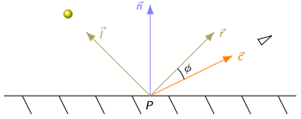
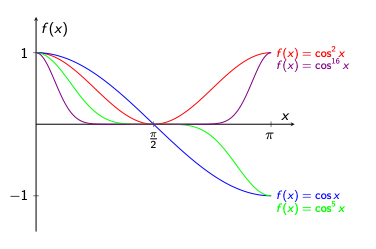

# Phongov osvetľovací model
Empirický osvetľovací model. Počíta intenzitu svetla pre každý fragment.

$$
I = I_a \cdot r_a + \sum_{i=1}^{m} (I_{d,i} \cdot r_d \cdot (\vec{l} \cdot \vec{n}) + I_{s,i} \cdot r_s \cdot (\vec{r} \cdot \vec{c})^h)
$$

- $r_a, r_d, r_s$ - koeficienty materiálu (ambient, diffuse, specular)
- $I_a$ - intenzita ambientného svetla
- $I_d$ - intenzita difúzneho svetla
- $I_s$ - intenzita spekulárneho svetla
- $\vec{l}$ - normalizovaný vektor smeru k svetlu
- $\vec{n}$ - normalizovaný normálový vektor
- $\vec{c}$ - normalizovaný vektor smeru kamery
- $\vec{r}$ - normalizovaný vektor odrazu svetla
- $h$ - exponent spekulárneho svetla (shininess)

## Ambientná zložika
Nepriame osvetlenie objektu. Zaisťuje, že aj časti objektu odvrátené od svetla vidíme, nie sú úplne čierne. Simuluje tyčinky v oku, vidíme niečo aj v tme...

## Difúzna zložka
Priame osvetlenie objektu, rozptýlený odraz. Je závislý na uhle svetla 

## Spekulárna zložka
Lesklé odrazy na objekte. Závisí na uhle odrazu svetla  a smerom ku kamere.

### Exponent spekulárneho svetla
Určuje veľkosť, rozptyl odlesku. ($cos(\phi) == (\vec{r} \cdot \vec{c})$)

## Ad. Útlm
$$
f_{att}(d) = \frac{1}{k_c + k_ld + k_qd^2}
$$

- $d$ - vzdialenosť od objektu
- $k_c$ - konštanta
- $k_l$ - konštanta lineárnej časti
- $k_q$ - konštanta kvadratickej časti