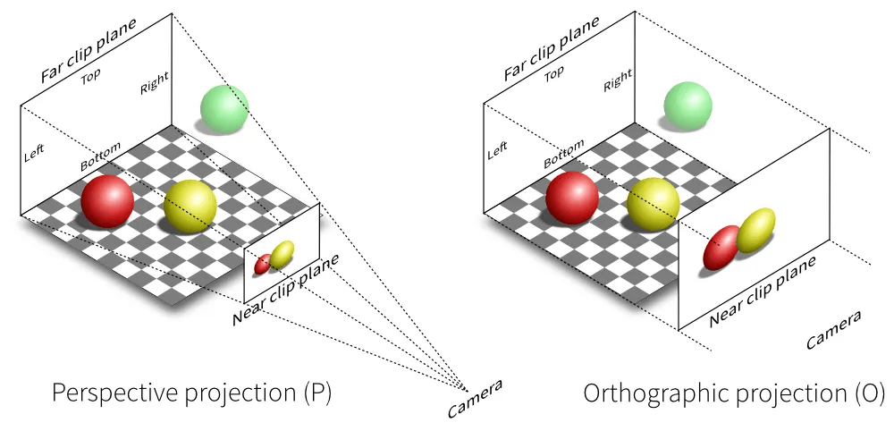

# Projekcia / Premietanie
Slúži na transformáciu 3D scény na 2D obraz.

## Definícia premietania

### Premietacie lúče 
Polopriamka vychádzajúca z bodu, ktorý sa premieta,
smer závisí na type premietania.
### Premietna 
Plocha v priestore, na ktorú dopadajú premietacie lúče. Nemusí byť rovina (pologuľa, NURBS plocha).

## Typy premietania

### Rovnobežné (ortogonálne)
Scéna je reprezentovaná ako pravouhlý hranol. Zachováva rozmery objektov, neskresľuje. Využitie v modelovacích softvéroch (Blender, Cinema4D, CAD).
Premietacie lúče sú rovnobežné.

#### Pohľady
- Nárys (ignoruje Z) - pohľad z predu
- Pôdorys (ignoruje Y) - pohľad z hora
- Bokorys (ignoruje X) - pohľad zo strany


### Perspektívne 
Scéna je reprezentovaná ako frustrum (časť ihlanu, ktorá leží medzi 2 rovnobežnými rovnami, inak, ihlan s odseknutým vrchom).
- skresľuje objekty, realistickejšie vnímanie priestoru.
- použité v projekte

#### Použitie
```cpp
glm::perspective(
    glm::radians(60.0f), // fovy
    width / height, // aspect
    0.1f, // zNear
    100.0f // zFar
)
```
- **zNear**: najbližšia rovina, kde sa objekty vykreslia, hodnota medzi 0.01 - 1.0, menšie hodnoty môžu spôsobiť z-fighting
- **zFar**: najvzdialenejšia rovina, kde sa objekty vykreslia, hodnota v rozsahu 100 - 1000

Vracia projekčnú maticu.

### Projekčná matica
Transformuje súradnice z view space (priestor kamery) do clip space (priestor orezávania). Prevádza frustrum na [-1,1] × [-1,1] × [-1,1], ale nie na NDC!



## Gimbal lock
Dve osi rotácie sa dostanú do jednej roviny. Splynú 2 rotačné osi do jednej. Stratíme 1 stupeň voľnosti. Pri natočení osy Y o 90°, stratíme 1 stupeň voľnosti.