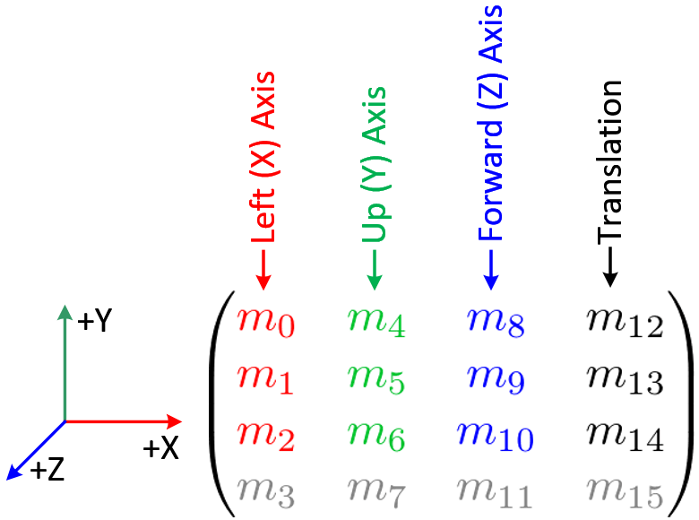

# Skybox
Objekt krychle s 3D textúrou, ktorý vytvára ilúziu vzdialených objektov v scéne, vykreslovaním objektu okolo kamery.

## Metódy vykreslenia
### Veľký objekt cez celú scénu
Môže presiahnúť zFar z projekčnej matice, nemusí sa celý vykresliť. Keby nastavíme veľký zFar, potom by sa vykresľovali objekty zbytočne ďaleko. 

### Malý objekt na pozícii kamery
```cpp
scene->renderSkybox();
glClear(GL_DEPTH_BUFFER_BIT);
```
Po vykreslení skyboxu, musíme vymazať Z-Buffer..

```glsl
mat4 skyboxViewMatrix = mat4(mat3(viewMatrix)); 
gl_Position = projectionMatrix * skyboxViewMatrix * vec4(vp, 1.0);
```

Musíme skybox presunúť do pozície kamery rotáciou z view matice (inak by sme videli napríklad hranu krychle). Musíme sa však zbaviť translácie objektu podľa kamery, aby bol vždy na pozícii kamery (nie relatívne od nej), výjmeme ju pomocou mat3, preložíme späť do mat4 (translation ostane (0,0,0)).

